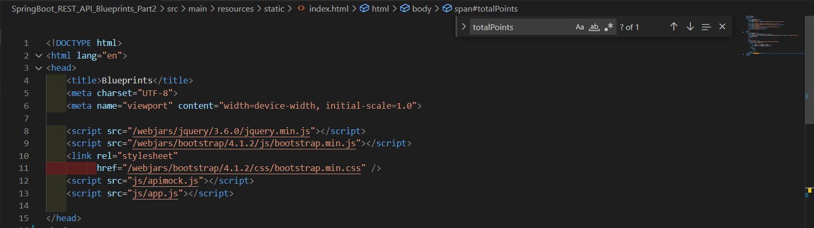
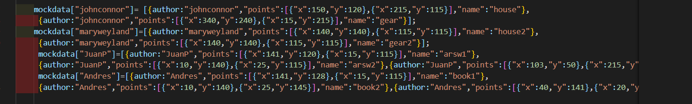
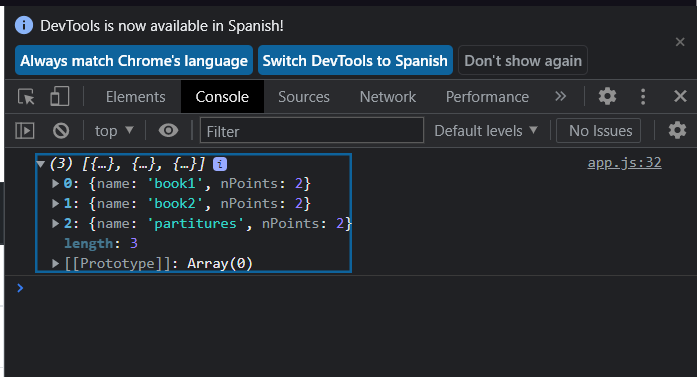
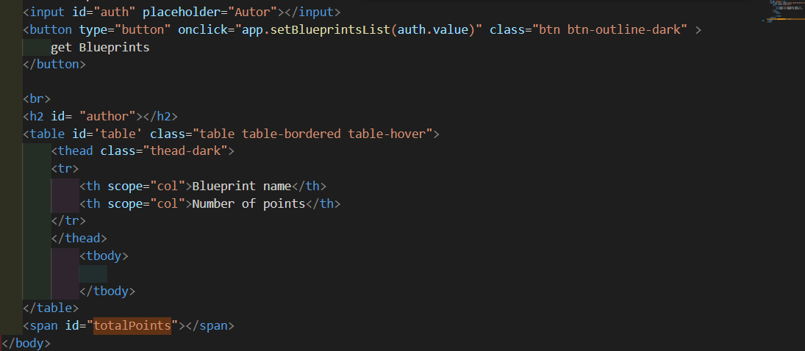
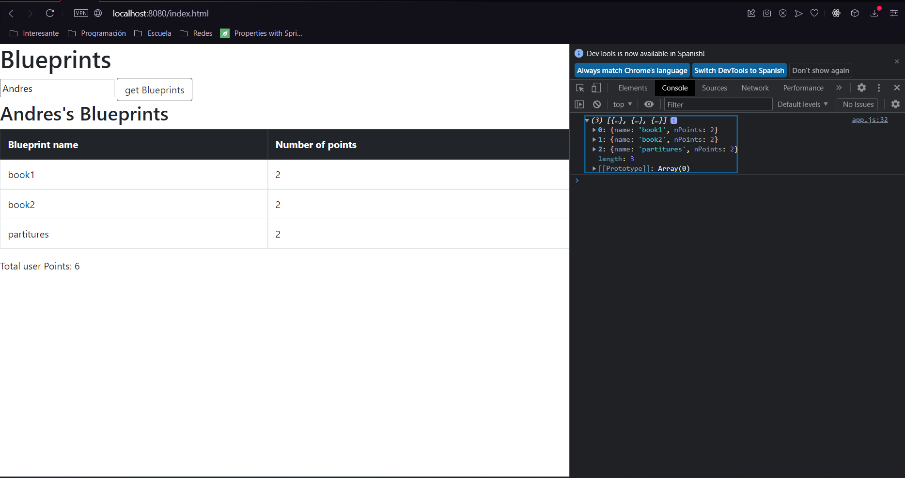

# LAB06ARSW

## Integrantes:
* **Juan Pablo Espinoza**
* **Juan Andrés Pico**
## Ajustes Backend
Se realizaron los siguientes cambios en el POM


## Front-End - Vistas
Se agregaron los respectivos directorios y se creo el index.html

También se agregaron las libreries correspondientes a JQuery y Bootstrap 

La pagina es correctamente accessiblo por 
```
    http://localhost:8080/index.html
```

## Front-End - Logica

Se hicieron los respectivos cambios de apimock.js y de app.js.
En el caso de apimock.js se agregaron los valores Andres y "JuanP en el objeto 

Tambien se probo que los datos de este objeto fuera realmente mostrados en consola:

Se comprobo que se estuvieran realizando los cambios y mostrados en pantalla por medio de un boton 

